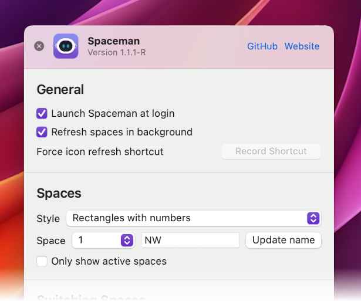
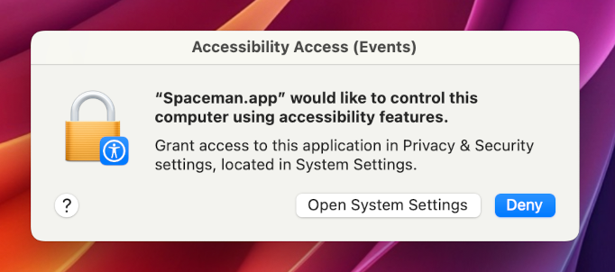
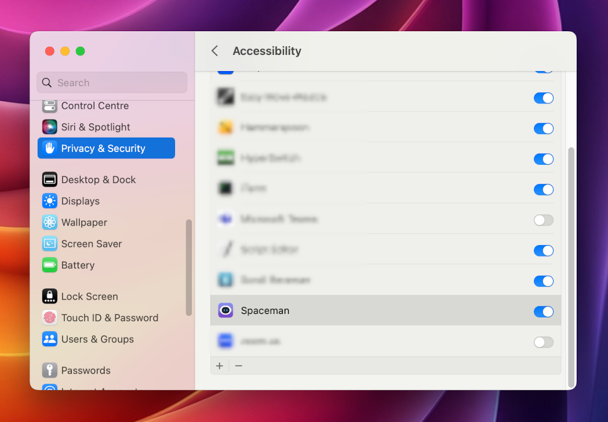
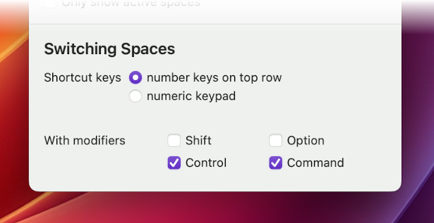

## About

Spaceman is an application for macOS that allows you to view your Spaces / Virtual Desktops in the menu bar. Spaceman allows you to see which space you are currently on (or spaces if you are using multiple displays) relative to the other spaces you have. Naming these spaces is also an option in order to organise separate spaces for your workflow.

Also, the menu enables switching between spaces.

**Spaceman requires macOS 11 Big Sur or greater.**

## Install

### GitHub

Go to the [releases](https://github.com/ruittenb/Spaceman/releases) tab and download **Spaceman.dmg** from the latest release.

## Usage

<a href="url"></a>

The above image shows the possible icons that you will see depending on the style you choose.

There are five styles to choose from, from top to bottom:
- Rectangles
- Numbers
- Rectangles with Numbers
- Rectangles with Desktop Numbers
- Named Spaces

The meaning of the icons from left to right are:

- Active Space
- Inactive Space
- Inactive Fullscreen App
- Gap (The gap denotes that the spaces that follow are on a different display)
- Inactive Space
- Active Fullscreen App

## Preferences

<a href="url"></a>

The style and the name of a space can be changed in preferences (shown above). A space is named by selecting the space from the dropdown, typing a name up to 4 characters and clicking the 'Update name' button.

If the icon fails to update, you can choose to force a refresh of the icon using a custom keyboard shortcut or allow Spaceman to refresh them automatically every 5 seconds by enabling 'Refresh spaces in background'. See [#2](https://github.com/Jaysce/Spaceman/issues/2).

### Switching Spaces

The menu shows a list of space names.

<a href="url"></a>

Choosing one will cause Spaceman to attempt to switch to that space.
This is done by sending a keyboard shortcut to Mission Control using `osascript`.
Note that only the first ten spaces will have shortcut keys assigned.
For other spaces, the menu option will be disabled.

For this to work successfully, the following things need to be configured:

- Spaceman needs authorization for Accessibility:

<a href="url"></a>
<a href="url"></a>

- Shortcut keys need to have been defined for Mission Control:

<a href="url"></a>

- Spaceman needs to know which shortcuts to send:

<a href="url"></a>

## Remote Refresh

The list of spaces can also be refreshed using Applescript:

```sh
$ osascript -e 'tell application "Spaceman" to refresh'
```

For details on how to maximize usefulness of this, see [MikeJL's Comments](README-Yabai.md)

## Troubleshooting

If Spaceman does not start, or does not start correctly, after an upgrade: you may need to delete the application defaults:

```sh
$ defaults delete dev.jaysce.Spaceman
```

## Attributions

- This project is based on [WhichSpace](https://github.com/gechr/WhichSpace)
- This project uses [Sparkle](https://sparkle-project.org) for update delivery
- This project makes use of [LaunchAtLogin](https://github.com/sindresorhus/LaunchAtLogin)
- This project makes use of [KeyboardShortcuts](https://github.com/sindresorhus/KeyboardShortcuts)
- Authors:
  - [Sasindu Jayasinghe](https://github.com/Jaysce/Spaceman)
  - [René Uittenbogaard](https://github.com/ruittenb/Spaceman)
- Contributions by:
  - [Dmitry Poznyak](https://github.com/triangular-sneaky/Spaceman)
  - [Grzegorz Milka](https://github.com/gregorias)
  - [Michael Lehenauer](https://github.com/mike-jl/Spaceman)
  - [Logan Savage](https://github.com/lxsavage/Spaceman)
  - [Yakir Lugasy](https://github.com/yakirlog/Spaceman)
  - [aaplmath](https://github.com/aaplmath)

