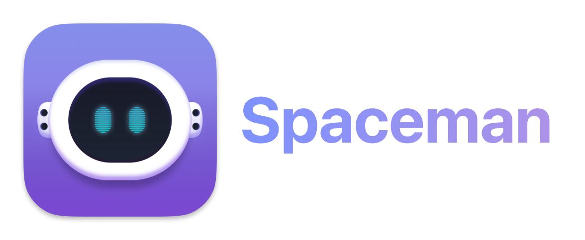

## About
Spaceman is an application for macOS that allows you to view your Spaces / Virtual Desktops in the menu bar. Spaceman allows you to see which space you are currently on (or spaces if you are using multiple displays) relative to the other spaces you have. Naming these spaces is also an option in order to organise separate spaces for your workflow.

**Spaceman requires macOS 15 Sequoia or greater.**

## Install
### Homebrew
```
brew install spaceman
```
### GitHub
Go to the releases tab and download **Spaceman.dmg** from the latest release.
## Usage
<a href="url"></a>

The above image shows the possible icons that you will see depending on the style you choose.

There are 4 styles to choose from, from top to bottom:
- Rectangles
- Numbers
- Rectangles with Numbers
- Named Spaces

The meaning of the icons from left to right are:

- Active Space
- Inactive Space
- Inactive Fullscreen App
- Gap (The gap denotes that the spaces that follow are on a different display)
- Inactive Space
- Active Fullscreen App

<a href="url"></a>

The style and the name of a space can be changed in preferences (shown above). A space is named by selecting the space from the dropdown, typing a name up to 3 characters and clicking the 'Update name' button or pressing enter.

If the icon fails to update, you can choose to force a refresh of the icon using a custom keyboard shortcut or allow Spaceman to refresh them automatically every 5 seconds by enabling 'Refresh spaces in background'. See [#2](https://github.com/Jaysce/Spaceman/issues/2).

## Attributions
- This project is based on [WhichSpace](https://github.com/gechr/WhichSpace)
- This project uses [Sparkle](https://sparkle-project.org) for update delivery
- This project makes use of [LaunchAtLogin](https://github.com/sindresorhus/LaunchAtLogin)
- This project makes use of [KeyboardShortcuts](https://github.com/sindresorhus/KeyboardShortcuts)
