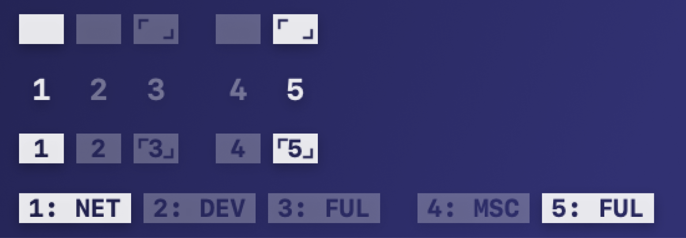

# Spaceman
## About
Spaceman is a menu bar application for macOS that allows you to easily visualise your arranged spaces (virtual desktops). Spaceman also allows you to name these spaces to organise your workflow.

## Installation
`TODO`
## Usage

The above image shows the possible icons that you will see depending on the style you choose.

From left to right:

- Active Space
- Inactive Space
- Inactive Fullscreen App
- Gap (The gap denotes that the spaces that follow are on a different display)
- Inactive Space
- Active Fullscreen App

The above image shows the preferences window where you can edit the name of a space or switch to a different style. The preferences window is accessed by clicked the icon in the menu bar and selecting Preferences from following menu:

Quitting the app is in the same menu.